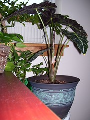

  
[101\_0123](http://www.flickr.com/photos/54325514@N00/193330681/)  
Originally uploaded by [Thirdlayer](http://www.flickr.com/people/54325514@N00/).

My Alocasia x Amazonica (Thanks to Dr. George Treadwell at Emory & Henry College for the name) is unfurling a new leaf!
