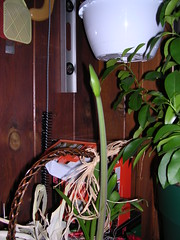

  
[Amarylis in bud](http://www.flickr.com/photos/54325514@N00/7431347/)  
Originally uploaded by [Sarah Williams](http://www.flickr.com/people/54325514@N00/).

This basket from Pam and Claudia was full of flowering bulbs that I will transplant this fall. The Amarylis bulb has already bloomed once and produces a brilliant red flower. I will give it a better location soon, but for the moment it is happy here on the service porch beside the orange tree.
