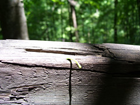

  
[inchworm\_shadow.jpg](http://www.flickr.com/photos/thirdlayer/3075471483/)  
Originally uploaded by [Thirdlayer](http://www.flickr.com/people/thirdlayer/)

I found this while organizing old photos. This one is from a couple of years ago at Natural Tunnel. I tried to photograph the inchworm for several minutes, and I got pretty good photos of his back end, since it pretty much remained anchored while he decided which way to go. His front was always in motion, as it is in this photo.
