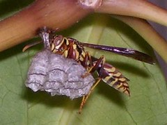

  
[Wasp.jpg](http://www.flickr.com/photos/thirdlayer/3255720016/)  
Originally uploaded by [Thirdlayer](http://www.flickr.com/people/thirdlayer/)

So how many kinds of a wasp is Ann Coulter? [And does she hate us because we aren't as cute as she is?](http://dir.salon.com/story/books/int/2003/07/25/bowman/)  
  
Here's a quote:

> It's been weeks since the last one, so on Sunday, The New York Times Magazine featured yet another cheery, upbeat article on single mothers. As with all its other promotional pieces on single motherhood over the years, the Times followed a specific formula to make this social disaster sound normal, blameless and harmless -- even brave.  
>   
> These single motherhood advertisements include lots of conclusory statements to the effect that this is simply the way things are -- so get used to it, bourgeois America! "(A)n increasing number of unmarried mothers," the article explained, "look a lot more like Fran McElhill and Nancy Clark -- they are college-educated, and they are in their 30s, 40s and 50s."
