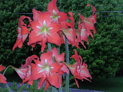
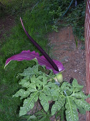

  
[DSCN4462](http://www.flickr.com/photos/54325514@N00/146574287/)  
Originally uploaded by [Thirdlayer](http://www.flickr.com/people/54325514@N00/).

  
[DSCN4472](http://www.flickr.com/photos/54325514@N00/152165455/)  
Originally uploaded by [Thirdlayer](http://www.flickr.com/people/54325514@N00/).

Thanks to Hayes Lavis for naming the flowers!  
  
The bright orange lily is an amaryllis. In my experience it is easier to grow and propagate than other amaryllis, and the blossom stalk is very tall compared to other varieties I have. This plant just continuously sprouts new bulbs and withstands all kinds of mistreatment -- it will winter over dry in a dark corner with no attention and blossom in the summer, or it will bloom repeatedly when kept year-round as an ordinary house plant. It will bloom in clusters (see photos) or single, and as the bulbs grow larger more blossoms will form on a single stalk. The latest cluster that I photographed had 22 blossoms on 6 stalks, 3 or 4 blossoms each.  
  
The purple stinky flower, _arum dracunculus vulgaris_, common name Dragon Lily, is in the arum family, related to the "carrion or corpse flower." Hayes provided a [link from which bulbs can be purchased](http://www.dutchgardens.com/on/demandware.store/Sites-DutchGardens-Site/default/ViewProductDetail-SellPage?OfferID=16406&SC=), if you want to enjoy the lovely fragrance. I noted that the people selling the bulbs don't tell you the flower stinks. And to be fair, only the flower stinks, and only for a day or so. The leaf is beautiful, and the giant flower is dramatic and colorful. But it is probably best not to plant too many of them, and not too near the door....
