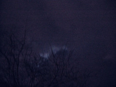

  
[night\_sky.jpg](http://www.flickr.com/photos/thirdlayer/2280104487/)  
Originally uploaded by [Thirdlayer](http://www.flickr.com/people/thirdlayer/)

The last chance to see a total lunar eclipse until 2015 -- and the sky here has over 90 percent cloud-cover. Here you can see the moon's light through a small rift in the clouds, but not much chance of seeing the show.
