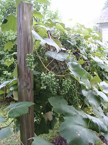

  
[Grapes38](http://www.flickr.com/photos/54325514@N00/23897111/)  
Originally uploaded by [Sarah Williams](http://www.flickr.com/people/54325514@N00/).

Watching the grapevine this year is more interesting than politics. Things keep moving along there, and it is beginning to look like there will be a return on investment.  
  
Politics is getting really frustrating. It seems that by now voters would have hit upon the idea that if we want better intelligence, then we ought to elect some. Who knows, with some better intelligence in the right place, we might be able to get government off their theocratic high horse and back to the [business of taking care of people and the environment](http://www.usconstitution.net/const.html#Preamble) -- medical care, building roads, creating jobs, worker safety, disaster relief -- things like that. Maybe we could even find a way out of the Iraq mess this administration has made, where we are involved in a civil war abroad where _nobody_ is on _our_ side, [our people](http://icasualties.org/oif/) and [theirs](http://www.iraqbodycount.net/) are dying every day, and we can't even explain what we are doing.  
  
On the Social Security thing, if you are young enough, bright enough, and have enough income, start yourself a stock market account that you can manage yourself. [That way you won't be giving your money to the Neo Cons to give to their cronies.](http://www.mynippon.com/social-security-privatization/2005/01/privatization-explained-in-simple.html) The money we pay in taxes and in Social Security contributions should do something for the common welfare of people. That is the proper function of government -- [domestic tranquility and the common good of people.](http://www.usconstitution.net/const.html#Preamble) Now I have to go and see if there are any bugs eating the grapevine...
