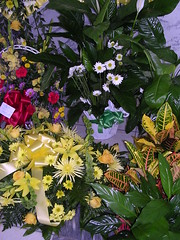

  
[flowers](http://www.flickr.com/photos/54325514@N00/40192824/)  
Originally uploaded by [Thirdlayer](http://www.flickr.com/people/54325514@N00/).

I was in South Carolina recently for the funeral of Carl's uncle, Herschel Glenwood ("Glen") Williams. When I was working on my M.Ed., I collected interviews from people who attended or taught in one-room or small schools in southwest Virginia, and Glen gave me one of the best descriptions of a small school that I found in my research.  
  
[This is a bit of history that Glen recorded for us](http://www.thirdlayer.org/sw/school/glenw.htm).
