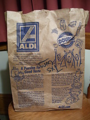

  
[100\_0644](http://www.flickr.com/photos/54325514@N00/336878746/)  
Originally uploaded by [Thirdlayer](http://www.flickr.com/people/54325514@N00/).

For the past few years, our family has gathered at my house for Thanksgiving, and we all have a great time. Everyone brings food, and I prepare the turkey and stuffing. We push back all of the furniture and set up long folding tables and folding chairs, and we all sit down together. My brother and sister are both ministers, so the crowded room and informal table setting is blessed with elegant words of grace as well as really good food.  
  
My family with one exception are all fundamentalists. If you have been reading my blog, you know who the exception is. After the meal and an hour or two of visiting, as goodbyes were being said, they were exchanging those little green buttons that they wear to tell you they are in the front line of defense in the War on Christmas, so you won't slip up and say "Happy Holidays" to them, or, worse, do the Xmas thing. They even offered me one.  
  
I said, "No, thank you."  
  
I think the buttons may be good for them, but I hope that we don't all have to start wearing tags so that people can tell what not to say to us.  
  
Anyway, as I was sorting out the kitchen after everyone had gone, I discovered the bag in the photo, obviously used by someone to carry something to the party.  
  
Now what, I ask you, is "Txs Gvng"? Is someone trying to take the "Thanks" out of "Thanksgiving"? Not only that, but they did a good job on the "Giving" as well. Out of context, I would not have known what "Txs Gvng" meant at all, so perhaps the meaning is also under fire.  
  
No, no! Not another holiday war!
