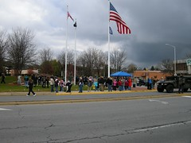

  
  
Originally uploaded by [Thirdlayer](http://www.flickr.com/people/thirdlayer/)

In the first few scattered snowflakes of the season this morning people came to downtown Bristol VA/TN for the yearly Veterans Day parade. This photo is of the crowd gathering at the Veteran's Memorial on Cumberland Street after the parade. Click on the photo to see more photographs of the parade.  
  
Many thanks to our veterans, who were represented by groups and individuals from Army, Air Force, Navy, Marines, and National Guard as well as ROTC units from regional high schools. The Red Cross, which plays a critical role in keeping families of deployed service members connected, was also in the parade along with several bands and service organizations. Groups and individuals also represented wars and military operations, including World War II, the Korean Conflict, and Vietnam.
