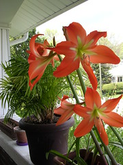

  
[DSCN4347](http://www.flickr.com/photos/54325514@N00/140044450/)  
Originally uploaded by [Thirdlayer](http://www.flickr.com/people/54325514@N00/).

A friend gave me these bulbs in 1990. They produced a small bright green leaf but no blossom until about the fourth year. New bulbs develop continuously, and I have given away many of them. I have yet to discover a name for them!
