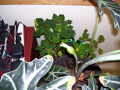

  
[100\_0802](http://www.flickr.com/photos/54325514@N00/368491192/)  
Originally uploaded by [Thirdlayer](http://www.flickr.com/people/54325514@N00/).

What else did we expect? Best to talk about something else, and hope the Democrats we elected to the Senate and the House will make a difference.  
  
So, here's someting else: In the middle of winter all of the flowers I keep at the office are doing interesting things! The Alocacia x Amazonica in the photo has a seed pod about to open, and then we can see if we can sprout the seeds! Over on Flickr there are photos of the amarylis that is blooming in the hallway by the windows and of the palm that is also doing its thing, whatever that is.
