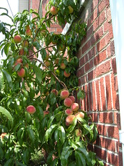

  
[Peaches1](http://www.flickr.com/photos/54325514@N00/27990433/)  
Originally uploaded by [Sarah Williams](http://www.flickr.com/people/54325514@N00/).

Well, the peaches are getting ripe and summer is coming to a close. We have had enough water and enough heat this summer, as the peach tree proves.  
  
My work is August through May with June and July off. Maybe when I get back in the swing of work, about the first of September, I can figure out something to do with this blog!
