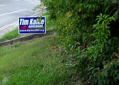

  
[Kaine4Gov](http://www.flickr.com/photos/54325514@N00/54148389/)  
Originally uploaded by [Thirdlayer](http://www.flickr.com/people/54325514@N00/).

I'm supporting the Democratic ticket in Southwest Virginia: [Tim Kaine](http://www.kaine2005.org/home.php), [Leslie Byrne](http://www.lesliebyrne.org/site/PageServer), and [Creigh Deeds](http://www.creighdeeds.com/).  
  
Last time I put out yard signs they were stolen, so this time I thought it would be wise to make a photograph.  
  
We had planned to mow the grass, but when it's shaggy it hides the trip wire better.
