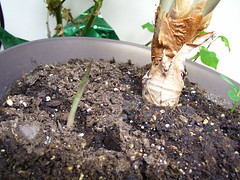

  
[100\_1464](http://www.flickr.com/photos/thirdlayer/1489293235/)  
Originally uploaded by [Thirdlayer](http://www.flickr.com/people/thirdlayer/)

I have plants at the office, and they always bloom or do exciting things while I am away. I have a week of next week, and this is how I left my Alocasia x Amazonica (Aftican Mask) on Friday afternoon. Probably this new leaf will be completely open on Monday, and by the time I am back on the next Monday there may be another one on the way!  
  
The parent plant is now 27 inches tall. It has five leaves, ranging from 11 to 15 inches in length. It has proven very hardy for a plant that arrived in an arrangement of cut flowers from a florist!
