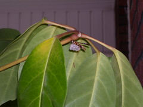

  
[Wasp.JPG](http://www.flickr.com/photos/54325514@N00/524032758/)  
Originally uploaded by [Thirdlayer](http://www.flickr.com/people/54325514@N00/)

I wish this little critter had gone elsewhere to construct the elegant little nest, because of course I will have to remove it. It is about 6 inches from the frame of my front door and about five feet above the floor of the front porch.  
  
Click the photograph for a larger view.
