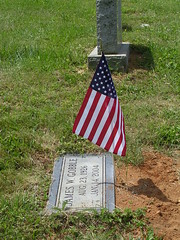

  
[MemorialDay05](http://www.flickr.com/photos/54325514@N00/16455022/)  
Originally uploaded by [Sarah Williams](http://www.flickr.com/people/54325514@N00/).

For family - This is Uncle Jay's grave at Sugar Grove Baptist Church in Benhams, Virginia. Jay was in World War II and in Korea.
