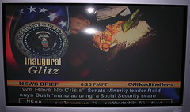

  
[no\_crisis](http://www.flickr.com/photos/54325514@N00/3454839/)  
Originally uploaded by [Sarah Williams](http://www.flickr.com/people/54325514@N00/).

About the Crisis in Social Security:  
  
No "WMD," or "shortage in flu vaccine," or "terrorist attack on election day" either.  
  
Social Security has financed itself and several other projects. If Social Security funds had not been used for other projects, the Baby Boomers would have paid for themselves -- or in my case, ourselves.  
  
Crisis talk is another attempt to frighten Americans into accepting autocratic rule by big business interests represented well by George W. Bush. The proposed reform will take the money of small investors out of their pockets directly to the accounts of people wealthy enough to diversify, protect investments, capture markets, and manipulate stock prices.
