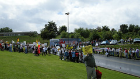

  
[DSCN1352\_c.jpg](http://www.flickr.com/photos/thirdlayer/3773425423/)  
Originally uploaded by [Thirdlayer](http://www.flickr.com/people/thirdlayer/)

This photo shows the protesters and the "bus they rode in on," waiting for President Obama to arrive in Bristol. The local people present included many Obama supporters, and a group of local volunteers assisted with the event.  
  
The bus people's signs reflect pretty much the whole range of right-wingnut issues -- abortion, liberal media, socialism, cap and trade and other green initiatives, and generally anything that FOX has told them to hate. One had a "Vote for Sarah Palin" sign, which I don't understand at all since Palen is currently doing the opposite of running for anything except a $$$ book contract where votes don't count. Another protester hurrying up the hill with the group after the motorcade had passed ran in front of us and then stopped a moment to apologize very politely. His sign said "The liberal media hates conservatives. The same back at you, Baby."  
  
Rain fell frequently throughout the day, and the bus people took credit for the weather at one point. They had a very loud PA system, and about half an hour before the motorcade arrived their master of ceremonies started his spiel by saying that God was with them because just as he picked up the microphone to speak the sun broke through the clouds. After a few minutes the rain was back, so perhaps God is at best ambivalent about their effort. As I read the New Testament, it appears to me that God would be pushing single-payer universal coverage -- not exactly a requirement to purchase anything, but a system where what you need is available on a whosoever will basis.
