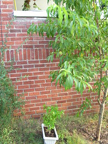

  
[Peach\_Tree](http://www.flickr.com/photos/54325514@N00/22871052/)  
Originally uploaded by [Sarah Williams](http://www.flickr.com/people/54325514@N00/).

Of course I don't get tired of watching my plants grow through the seasons and taking photos of them!  
  
The peach tree has a fair number of peaches this year. The white planter has three grapefruit tree seedlings that are about two or three years old. It was on the bannister above. A thunderstorm last night with some strong wind knocked the planter off, and I found it this morning, upright and unharmed, sitting under the peach tree.
