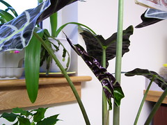

  
[100\_0530](http://www.flickr.com/photos/54325514@N00/285739243/)  
Originally uploaded by [Thirdlayer](http://www.flickr.com/people/54325514@N00/).

Look! My Alocasia x Amazonica is getting another new leaf! It appears that this one will not be as tall as the last one -- maybe an effect of the cooler temperatures, maybe a difference in watering. Click on the photo for more images, some with blossoms!
