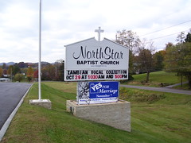

  
[100\_0472](http://www.flickr.com/photos/54325514@N00/278680812/)  
Originally uploaded by [Thirdlayer](http://www.flickr.com/people/54325514@N00/).

Churches under the constitutions of the United States and of Virginia enjoy a tax exempt status. They relinquish that status when they become political action committees and tell people how to vote.  
  
It may be good that churches are getting into this, since there is significant property and income there, and if it were taxable we might have a hope of paying off the bill for the Iraq war in the lifetimes of our children's children.  
  
Maybe that is what they mean by "protect the children."
