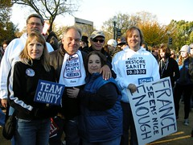

  
[DSCN2571](http://www.flickr.com/photos/thirdlayer/5134797948/)  
Originally uploaded by [Thirdlayer](http://www.flickr.com/people/thirdlayer/)

Folks from Bristol who usually are working very hard for Democrats and sane politicians locally, regionally, state, and federal took a break this past weekend to attend the Rally to Restore Sanity and/or Fear in Washington, DC. In this photo are Carl, Richard, Catherine, Terry, Aviva, and Glen. Sarah is behind the camera, and Sherry and Barry are somewhere in the crowd.  
  
We all had a great time, and after the event we agreed that we were more sane than before. It was great to see all of the signs and talk to folks from everywhere! We are hearing that we had 215,000 people in attendance, well above the expected (planned for) 60,000,  
  
The show was great, and a lot of clips are available on YouTube, including the video of [the final address by Jon Stewart.](http://www.youtube.com/watch?v=6JzGOiBXeD4)  
  
Click the photograph to go to our album on Flickr, and to see more rally photos on [Flickr.com](http://www.flickr.com), type "#sanityandorfear" in the search field at the top of the page.
