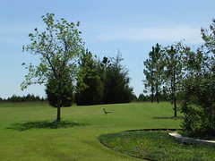

  
[Roadrunner1](http://www.flickr.com/photos/54325514@N00/36022643/)  
Originally uploaded by [Sarah Williams](http://www.flickr.com/people/54325514@N00/).

We spent the last week in Norman, Oklahoma. Carl had classes, but I was free to loaf around all day. On Wednesday the sky cleared after three days of rain, and a security officer of the hotel (Thanks, James!) took me up to the roof of the 6-story hotel to make some photographs of the grounds and the surrounding skyline.  
  
The roadrunner photograph in this entry is not one of those shots from the roof, but you can see those and some others we took in Norman by going through the link at [BristolCountry.com](http://www.bristolcountry.com).  
  
From the roof, James pointed out some interesting buildings in the area, and one of them was the Saxon Publishers building. He said I should go see their lobby, because it was a beautiful interior. Well, we drove over that evening, but the building was deserted and apparently for sale. I stepped out of the van to make a photograph of the gate, which still had the Saxon name, and off to my left in the grass the roadrunner appeared. I had not seen one before, so in the 105 degree heat I followed him and got a few photographs. He finally got tired of me and took off across the road. I got back in the van and we started to drive away, but we saw the roadrunner in the taller grass on the other side of the road. Carl made the last two photos from the van window.  
  
After we left the roadrunner, we went to the Oklahoma University campus to see their natural history museum, and there are a couple of photos from the museum on my Flickr page along with other pictures of the roadrunner.
