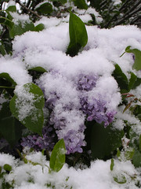
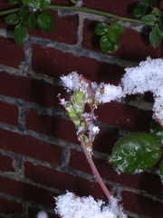
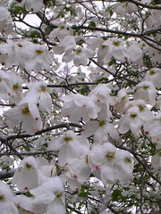

  
[lilac in snow](http://www.flickr.com/photos/54325514@N00/13463830/)  
Originally uploaded by [Sarah Williams](http://www.flickr.com/people/54325514@N00/).

If you live in Virginia, you don't expect snow on April 24th.  

  
[aphids in snow](http://www.flickr.com/photos/54325514@N00/13463825/)  
Originally uploaded by [Sarah Williams](http://www.flickr.com/people/54325514@N00/).

What you expect on April 24th is aphids on your spring rosebuds.  

  
[dogwood in snow](http://www.flickr.com/photos/54325514@N00/13463826/)  
Originally uploaded by [Sarah Williams](http://www.flickr.com/people/54325514@N00/).

Not snow all over your dogwood blossoms.
