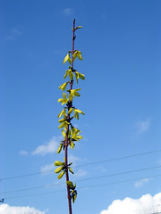

  
[forsythia1](http://www.flickr.com/photos/54325514@N00/111142792/)  
Originally uploaded by [Thirdlayer](http://www.flickr.com/people/54325514@N00/).

Well, almost. The forsythia hedge blooms early, and usually I can get a couple of photos with snow on the blossoms, so we can have some cold weather yet.  
  
I cut the forsythia to the ground every second year so that it grows long wands and does not get too dense or acquire dead stems. It is in it's second year, so some of the wands are 15 feet or longer. More photos on the Flickr page!
