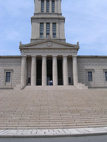

  
[steps](http://www.flickr.com/photos/54325514@N00/14612092/)  
Originally uploaded by [Sarah Williams](http://www.flickr.com/people/54325514@N00/).

Carl and John on the steps of the George Washington Masonic temple in Alexandria. We had a great visit with John and Sarah, stopping on the way up to visit with Jackie and Tim at [Folly Castle in Petersburg](http://www.follycastle.com) and stopping on the way back to visit a friend in Appomattox. More photos to come (including some made at the Baltimore Aquarium) on [Flickr](http://www.flickr.com). I would stay and post more photos, but you know how it is... work, work, work...
