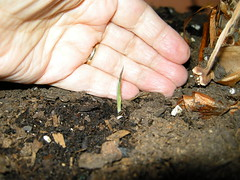

  
[DSCN0745.JPG](http://www.flickr.com/photos/thirdlayer/3118837077/)  
Originally uploaded by [Thirdlayer](http://www.flickr.com/people/thirdlayer/)

I decided to try keeping soil around the Alocacia x Amazonica a little wetter to see if it would send up a shoot, and it took less than two weeks for one to emerge.
