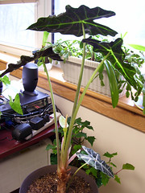

  
[AXA86.jpg](http://www.flickr.com/photos/54325514@N00/441170228/)  
Originally uploaded by [Thirdlayer](http://www.flickr.com/people/54325514@N00/).

I have finally gotten everything back together to get from the camera to the blog! Meanwhile, my Alocacia x Amazonica has blossomed again and unfurled another new leaf.  
  
The seed pod that I was watching did not mature. The stem wilted , and I was not able to gather any seed to see if I could start new plants from seed.  
  
More photos over on Flickr in the set - 
  
I am still enjoying my new Macintosh and trying to figure out what it is doing.
