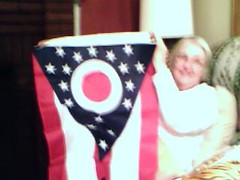

  
[Ohio.jpg](http://www.flickr.com/photos/thirdlayer/2967560739/)  
Originally uploaded by [Thirdlayer](http://www.flickr.com/people/thirdlayer/)

On October 15th a radio talk show host ventured a whole psychological profile of Barack Obama based on the fact that he [has created his own flag](http://mediamatters.org/items/200810220008) to replace the American flag. I'm still trying to figure out how he managed not to notice that Barack Obama was in Ohio, where an "O" might be expected on a flag.
